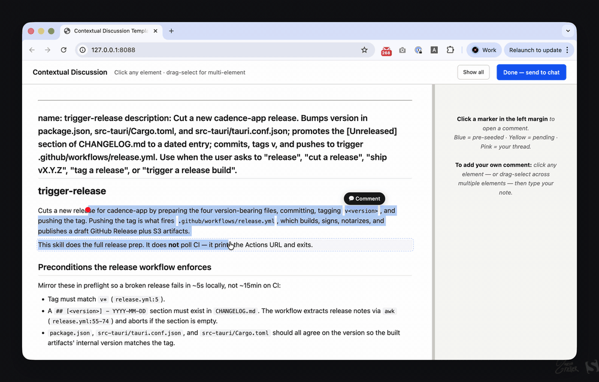

# Discuss CLI

**Stop reviewing agent plans in the terminal.**



`discuss` opens any Markdown file (or piped stdin) in your browser with PR-style comment threads on every paragraph. Your Codex or Claude Code session reads your comments and replies in the margins — same terminal session, no copy-paste.

Anchored. Threaded. Bidirectional. No cloud.

## Why?

Markdown is how engineers share everything that isn't code — PRDs, design docs, RFCs, incident post-mortems, analysis notes. But review tools assume the thing being reviewed is a diff. Docs either get copy-pasted into a chat window, marked up in Google Docs comments no agent can read, or ignored.

`discuss` makes the doc itself the workspace:

- **Inline anchored threads** — click any paragraph, drop a comment, get a threaded response.
- **Multi-file sessions** — `discuss a.md b.md c.md` reviews several files in one session with a file sidebar.
- **First-class diff review** — `discuss diff` opens the staged git diff with per-hunk syntax highlighting and line-anchored threads. Combines with the file list: `discuss plan.md diff HEAD~1..HEAD`.
- **Syntax highlighting** — tag fenced code blocks with a language (e.g. ` ```rust `, ` ```diff-typescript `) for browser-side highlighting. See [Prism's supported languages](https://prismjs.com/#supported-languages) for the full set.
- **Takes vs replies** — the agent posts *takes* (its view), humans post *replies*. Rendered distinctly so you can tell who said what at a glance.
- **Bidirectional** — the browser writes through a local REST API; the agent reads stdout events and writes back through the same API.
- **No cloud.** One Rust binary, one localhost server, one browser tab.

## Install

### Pre-built binary (`curl | sh`)

```sh
curl -sSL https://raw.githubusercontent.com/codesoda/discuss-cli/main/install.sh | sh
```

Downloads the latest release tarball from GitHub, installs the binary to `~/.discuss/bin/`, symlinks `~/.local/bin/discuss`, fetches the `/discuss` skill files into `~/.discuss/skills/discuss/`, and links them into every agent root present (`~/.claude/skills/`, `~/.codex/skills/`, `~/.agents/skills/`).

### From a clone

```sh
git clone https://github.com/codesoda/discuss-cli.git
cd discuss-cli
./install.sh
```

Same outcome as the curl path, but builds the binary from source with `cargo build --release` and links the skill directly out of the clone so `git pull` updates it.

## Quick Start

### With an agent (the main use case)

In Claude Code, Codex, or any agent with the `/discuss` skill, just ask:

> Can you discuss ./plan.md with me?

The agent invokes the skill. If `discuss` isn't on your PATH yet, it'll prompt before running the installer:

> `discuss` isn't on your PATH. Install it now? (runs `curl -sSL https://raw.githubusercontent.com/codesoda/discuss-cli/main/install.sh | sh`)

Confirm — the installer self-bootstraps in the background, the server launches on `http://127.0.0.1:7777`, your browser opens with the rendered doc, and the agent starts streaming events. Drop an inline thread anywhere and the agent replies with a take.

### Without an agent

```sh
discuss ./plan.md
```

Browser opens on `http://127.0.0.1:7777`. You get the full review UI — inline threads, replies, resolution — without any agent participation. Useful for solo review.

### Piping markdown via stdin

`discuss` reads from stdin when given `-` explicitly, or auto-detects a non-TTY stdin when no file argument is supplied. Useful for ad-hoc review of generated markdown without writing a temp file:

```sh
git diff --cached | render-as-markdown | discuss -
echo "# Quick note\n\nReview this." | discuss
```

In stdin mode, `session.started` reports `source_file: "<stdin>"` and history archives are written under `<history-dir>/unnamed/<timestamp>.json` since there's no source path to derive a folder name from. Bare `discuss` in an interactive terminal still prints help and exits 2.

### Reviewing multiple files

```sh
discuss plan.md design.md notes.md
```

All files open in a single session with a left sidebar for switching between them. Threads, drafts, and resolutions are scoped per file, and the sidebar badges show open-thread counts so nothing gets missed. The transcript groups threads by file in CLI order. Duplicate paths fail loudly; `-` (stdin) can appear once anywhere in the list. History archives for multi-file sessions land under `<history-dir>/multi-<N>-files/`.

`.diff` / `.patch` files in the list render as diff review sections automatically.

### Reviewing a git diff

```sh
discuss diff                    # staged (git diff --cached)
discuss diff --unstaged         # working tree
discuss diff HEAD~3..HEAD       # arbitrary range
discuss diff main...feature     # branch comparison
discuss plan.md diff            # plan + staged diff in one session
```

Each changed file gets its own entry in the sidebar, rendered as one fenced `diff-<lang>` block per hunk — so Prism highlights the diff *and* the underlying language, and line-anchored threads land directly on added/removed lines. `session.started` gains `mode` (`markdown` / `diff` / `mixed`) and `git_args` so agents know what they're reviewing.

Diff output is capped at 5 MB to keep the browser responsive; override with `--max-diff-bytes <N>` (0 disables), `max_diff_bytes` in `discuss.config.toml`, or `DISCUSS_MAX_DIFF_BYTES`.

### Reviewing a staged git diff (custom prompt)

> ⚠️ **Deprecated in favor of `discuss diff`.** The built-in diff mode above skips the markdown-wrapper round trip entirely. This prompt path is kept for users on older binaries and will be removed from the docs in a release or two.

Stdin + syntax highlighting + line-anchored threads make `discuss` a natural pre-commit review surface. Drop this in a custom prompt your agent can run before each commit:

> Before committing, open the staged diff for review in discuss.
>
> Generate a temporary markdown file from the currently staged diff. Split the diff by file. For each file, add:
> 1. a short summary of why the file is changing
> 2. a short summary of what the change does
> 3. the staged diff in a separate fenced diff code block
>
> Use `git diff --cached -U10` so each hunk includes 10 lines of original file context, and let nearby hunks merge naturally. Open it with `discuss` in browser-opening mode. Do not use `--no-open`. Watch the discuss session until `session.done`, respond to comments with takes, and do not commit until I explicitly confirm after the review.

The agent's per-file prose anchors block-level threads ("why is this changing?"), and the fenced ` ```diff ` blocks let you drop line-anchored comments directly on the added/removed lines. No PR, no Google Doc, no copy-paste — just review-then-commit in one terminal session.

## CLI

| Command | Description |
|---------|-------------|
| `discuss <file>...` | Open one or more files in a browser-based review session |
| `discuss -` | Read markdown from stdin explicitly (once, anywhere in the file list) |
| `<cmd> \| discuss` | Auto-detected stdin (non-TTY) — same as `discuss -` |
| `discuss diff [args]` | Review a git diff (staged by default; `--unstaged` or range/commit args) |
| `discuss <file>... diff [args]` | Review files and a git diff together in one session |
| `discuss update --check` | Check GitHub for a newer release |
| `discuss update -y` | Download the latest release, verify checksum, self-replace |

### Flags

| Flag | Default | Description |
|------|---------|-------------|
| `--port <N>` | `7777` | Bind port. No free-port fallback — fails fast if already bound. |
| `--no-open` | off | Don't auto-launch the browser |
| `--history-dir <path>` | `~/.discuss/history` | Where transcripts get written |
| `--no-save` | off | Don't persist transcripts |
| `--max-diff-bytes <N>` | `5242880` | (diff mode) Diff size cap; `0` disables |
| `--verdict-options <SPEC>` | off | Offer finish-review choices; SPEC is `id[:label][:style][!]` separated by `\|`, e.g. `approved:Approve:positive\|declined:Decline:negative!` |
| `--verdict-prompt <TEXT>` | default prompt | Custom prompt text shown above verdict options |

Verdict flags are global and must appear before `diff`; shell-quote specs containing `|`.

## HTTP API

While the server is running:

| Method | Path | Purpose |
|--------|------|---------|
| `GET` | `/api/state` | Current snapshot: threads, replies, takes, drafts, files, verdictConfig |
| `GET` | `/api/events` | SSE event stream (browser UI) |
| `POST` | `/api/threads` | Create a thread (`fileId` required when several files are loaded) |
| `POST` | `/api/threads/{id}/replies` | Add a **human** reply |
| `POST` | `/api/threads/{id}/takes` | Add an **agent** take |
| `POST` | `/api/threads/{id}/resolve` | Resolve a thread |
| `POST` | `/api/threads/{id}/unresolve` | Unresolve |
| `POST` | `/api/done` | Finish the review; requires a verdict body when verdict options are configured |
| `DELETE` | `/api/threads/{id}` | Soft-delete (`kind = "user"` only) |

## Stdout events

One newline-delimited JSON object per line. Consumed by the `/discuss` skill via Monitor; any line-reader works.

| Kind | When |
|------|------|
| `session.started` | Server bound and listening |
| `thread.created` | User opened a new thread |
| `reply.added` | Human posted a reply |
| `thread.resolved` / `thread.unresolved` | Resolution toggled |
| `thread.deleted` | Soft-delete |
| `prompt.suggest_done` | Idle timeout fired |
| `session.done` | Final transcript payload; includes optional verdict when `--verdict-options` was used |

Draft keystrokes and agent takes broadcast via SSE only — they never surface on stdout.

## Agent integration

The skill lives at [`skills/discuss/SKILL.md`](skills/discuss/SKILL.md) and targets:

- **Claude Code** — `~/.claude/skills/discuss`
- **Codex** — `~/.codex/skills/discuss`
- **Cline / Warp / anything respecting `~/.agents/skills/`**

What the skill handles:

- Launching `discuss <file>` as a background task
- Streaming stdout events via the agent's Monitor primitive
- Posting takes in response to user-opened threads
- Self-bootstrapping the binary if it isn't installed

## License

MIT
