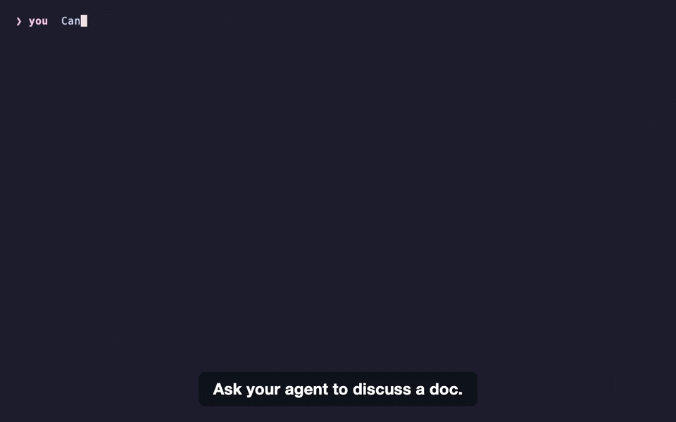

# Discuss CLI

**Stop reviewing agent plans in the terminal.**



<sub>Higher-quality video: [docs/demo.mp4](docs/demo.mp4) · recording pipeline: [docs/demo-script.md](docs/demo-script.md)</sub>

`discuss` opens Markdown, diffs, images, local HTML prototypes, and running HTTP/S websites in your browser. It adds anchored, PR-style threads to each one. Your Codex or Claude Code session reads your comments and replies in the margins. Same terminal session, no copy-paste.

Anchored. Threaded. Bidirectional. No cloud.

## Why?

Engineers share most non-code work as markdown: PRDs, design docs, RFCs, post-mortems. Review tools assume the thing under review is a diff. So docs get pasted into chat windows or marked up where no agent can read them.

`discuss` makes the doc itself the workspace:

- **Inline anchored threads** — click any paragraph, drop a comment, get a threaded response.
- **Multi-file sessions** — `discuss a.md b.md c.md` reviews several files in one session with a file sidebar.
- **Image review** — `discuss mockup.png` renders the image. Drop numbered pins to anchor threads to coordinates.
- **First-class diff review** — `discuss diff` opens the staged git diff with per-hunk syntax highlighting and line-anchored threads. It combines with the file list: `discuss plan.md diff HEAD~1..HEAD`.
- **HTML prototype review** — `discuss prototype.html` renders the local prototype and its relative assets in a sandboxed iframe. Inspect mode anchors threads to DOM elements with resilient selector fallbacks.
- **Live website review** — `discuss http://localhost:3000` proxies a running app through a second loopback origin, preserving root assets, app APIs, WebSockets, and SPA routes while injecting the element inspector.
- **Rich rendering** — Prism highlights tagged code fences (e.g. ` ```rust `, ` ```diff-typescript `). ` ```mermaid ` fences render as diagrams. YAML frontmatter renders as a collapsed, threadable block. See [Prism's supported languages](https://prismjs.com/#supported-languages).
- **Takes vs replies** — the agent posts *takes* (its view), humans post *replies*. The UI renders them distinctly so you can tell who said what.
- **Agent pre-annotations** — an agent that edited the doc can open `kind: "agent"` threads before you start reading. Each one marks a change and explains it.
- **Live source updates** — the agent can push new markdown into a running session via `POST /api/source`. Threads re-anchor without a restart.
- **Bidirectional** — the browser writes through a local REST API. The agent reads stdout events and writes back through the same API.
- **Navigation and themes** — a thread summary popover lists all threads and jumps to any of them. Open thread panels have ‹ / › prev/next buttons. The UI supports light, dark, and system themes.
- **No review cloud.** One Rust binary, loopback-only local servers, one browser tab.

## Install

### Pre-built binary (`curl | sh`)

```sh
curl -sSL https://raw.githubusercontent.com/codesoda/discuss-cli/main/install.sh | sh
```

The installer downloads the latest platform release from GitHub. It installs the binary to `~/.discuss/bin/` and symlinks `~/.local/bin/discuss`. It fetches the `/discuss` skill files into `~/.discuss/skills/discuss/`. It links them into every agent root present: `~/.claude/skills/`, `~/.codex/skills/`, `~/.agents/skills/`. Supported Unix targets are macOS arm64, macOS x86_64, and Linux x86_64.

### Windows PowerShell

```powershell
irm https://raw.githubusercontent.com/codesoda/discuss-cli/main/install.ps1 | iex
```

The script downloads and verifies the latest Windows x86_64 release. It installs `discuss.exe` under `$HOME\.discuss\bin`. It adds a command wrapper under `$HOME\.local\bin` and updates the user PATH. Open a new terminal after installation.

### From a clone

```sh
git clone https://github.com/codesoda/discuss-cli.git
cd discuss-cli
./install.sh
```

Same outcome as the curl path. This path builds the binary from source with `cargo build --release`. It links the skill directly out of the clone, so `git pull` updates it.

### Staying current

Run `discuss update --check` to check for a newer release. Run `discuss update -y` to install it without a prompt. The browser header also shows a version badge. When a newer release exists, open the badge to see the release notes for every version since the one currently running and copy `discuss update -y`.

## Quick Start

### With an agent (the main use case)

In Claude Code, Codex, or any agent with the `/discuss` skill, just ask:

> Can you discuss ./plan.md with me?

The agent invokes the skill. If `discuss` isn't on your PATH yet, the agent prompts before it runs the installer:

> `discuss` isn't on your PATH. Install it now? (runs `curl -sSL https://raw.githubusercontent.com/codesoda/discuss-cli/main/install.sh | sh`)

Confirm the prompt. The installer bootstraps in the background. The server binds an OS-assigned loopback port. Your browser opens at the reported address. The agent starts streaming events. Drop an inline thread anywhere and the agent replies with a take.

### Without an agent

```sh
discuss ./plan.md
```

The browser opens at the address printed on stderr as `review UI/API: http://127.0.0.1:<port>`. You get the full review UI — inline threads, replies, resolution — without any agent participation. Useful for solo review.

First time here? `discuss demo` opens a self-contained six-file tour — the feature GIF, two markdown docs pre-annotated with agent takes, a diff, an image, and an HTML prototype — with a canned Demo agent that replies to your comments. Every file is embedded in the binary: no agent session, no LLM, no history writes. The page itself behaves like any other session, so it still loads Prism syntax highlighting from a CDN and checks for a newer release; with no network the demo runs, minus code highlighting and per-line diff comments.

### Piping markdown via stdin

`discuss` reads from stdin when given `-` explicitly. It also auto-detects a non-TTY stdin when you give no file argument. Use this for ad-hoc review of generated markdown without a temp file:

```sh
git diff --cached | render-as-markdown | discuss -
echo "# Quick note\n\nReview this." | discuss
```

In stdin mode, `session.started` reports `source_file: "<stdin>"`. History archives land under `<history-dir>/unnamed/<timestamp>.json` because there is no source path. Bare `discuss` in an interactive terminal prints help and exits 2.

### Reviewing multiple files

```sh
discuss plan.md design.md notes.md
```

All files open in one session with a left sidebar for switching. Repository-relative paths are grouped into an expandable folder tree; each folder can be collapsed independently, and selecting a file automatically reopens its ancestors. Threads, drafts, and resolutions are scoped per file. File and folder badges show open-thread counts so you miss nothing. The compact collapsed rail remains a flat icon view. The transcript groups threads by file in CLI order. Duplicate paths fail loudly. `-` (stdin) can appear once anywhere in the list. History archives for multi-file sessions land under `<history-dir>/multi-<N>-files/`.

`.diff` / `.patch` files in the list render as diff review sections automatically.

### Reviewing an image

```sh
discuss mockup.png
discuss plan.md mockup.png
```

PNG, JPEG, GIF, WebP, and SVG files render through an `` element. Click the image to drop a numbered pin and open a thread. Image threads carry `imageAnchor: {xPct, yPct}` in basis points (`4200` = 42.00%). They use the pin number in `anchorStart`/`anchorEnd`. Images mix freely with markdown and diff files in one session.

Two limits apply in this first version. `POST /api/source` is not supported for image files. Unsent pin text is local-only and is lost on reload.

### Reviewing an HTML prototype

```sh
discuss ./prototype.html
```

The prototype runs in a same-origin iframe sandboxed with `allow-scripts allow-same-origin`. Click **Inspect** (or press `I`), hover to outline an element, then click it to open a thread. Saved threads render as numbered in-frame markers. Opening a thread scrolls the prototype back to its element. Selectors use stable ids and data attributes when available. Structural fallbacks come next, then text similarity as a final reattachment fallback.

Relative CSS, JavaScript, images, and fonts resolve from the HTML file's directory. Asset paths are canonicalized and cannot escape that directory. Root-absolute URLs such as `/img/logo.png` are not rewritten; use relative URLs. Served copies have CSP meta tags removed so the injected inspector can run. Closed shadow-root internals cannot be selected in v1; anchor the host instead. Live file watching/reload is not included, and `POST /api/source` is not supported for HTML files.

See [`examples/prototype.html`](examples/prototype.html) for a small fixture.

### Reviewing a live website

```sh
discuss http://localhost:3000
discuss https://example.test/path
```

A sole HTTP/S URL starts two loopback-only listeners: the Discuss UI/API and a fixed-upstream reverse proxy loaded by the iframe. The second origin prevents the app's `/`, `/api/*`, root-absolute assets, and WebSockets from colliding with Discuss routes. HTML responses have frame-blocking CSP/X-Frame-Options removed and receive an early service-worker guard plus the inspector; non-HTML bytes pass through unchanged. Same-upstream redirects stay proxied, while cross-origin redirects require an explicit choice. SPA routes are shown above the iframe and stored on element anchors.

The live iframe permits scripts, same-origin app behavior, forms, modals, popups, and downloads, but cannot navigate the top-level Discuss tab. This is intended for local development apps and public pages, not arbitrary production compatibility. Upstream cookies do not implicitly carry to the loopback proxy; v1 has no `--cookie` or `--cookie-file` flags, browser-profile import, transparent SSO, or anti-bot bypass.

`session.started` reports `mode: "live"`, the unchanged `upstreamUrl`, the actual `proxyUrl`, and the API `endpoints` map. Agents must use the reported API endpoints for all Discuss mutations—never `proxyUrl`, which is only the iframe's fixed-upstream website origin. With no `--port`, both listeners use independent OS-assigned ports. With explicit `--port N`, the API binds exactly to `N` and the proxy to `N + 1`; either collision fails before readiness.

### Reviewing a git diff

```sh
discuss diff                    # staged (git diff --cached)
discuss diff --unstaged         # working tree
discuss diff HEAD~3..HEAD       # arbitrary range
discuss diff main...feature     # branch comparison
discuss plan.md diff            # plan + staged diff in one session
```

Each changed file gets its own entry in the expandable folder tree. Each hunk renders as a fenced `diff-<lang>` block with GitHub-like file-header, hunk, addition, deletion, and context colors. A local prefix-based fallback preserves diff coloring when Prism's language grammar is unavailable. Line-anchored threads land directly on added or removed lines. Threads on code blocks carry a `lineRange {start, end}` field. `session.started` gains `mode` (`markdown` / `diff` / `mixed`) and `git_args` so agents know what they are reviewing.

Diff output is capped at 5 MB to keep the browser responsive. Override with `--max-diff-bytes <N>` (0 disables), `max_diff_bytes` in `discuss.config.toml`, or `DISCUSS_MAX_DIFF_BYTES`.

### Reviewing a GitHub pull request privately

```sh
discuss pr https://github.com/acme/project/pull/123
```

PR mode accepts a full `https://github.com/OWNER/REPO/pull/NUMBER` URL only. The local server does not store a GitHub token or call GitHub itself. Instead, `session.started` gives the active agent authenticated-`gh` instructions and a bearer-protected loopback import endpoint. The agent loads PR metadata and all existing discussion, uses `gh repo clone` plus the immutable PR ref in a temporary filtered clone, and generates the aggregate `git diff --unified=10` exactly once. It splits that result into one review file per changed path and imports a GFM overview plus the diff files into the session.

The overview distinguishes issue comments, review summaries, and review threads while preserving authors, timestamps, IDs, and GitHub links. Resolvable inline review discussion is also anchored on its diff. Every textual hunk includes ten unchanged context lines by default; binary and mode-only files remain visible but unanchorable.

Everything created during review stays local by default. Diff file headers include the file's green addition and red deletion totals, are not generic thread click targets, and use a dedicated speech-bubble control for explicit whole-file local comments. Each changed-file header also includes a **Viewed** checkbox; marking it records the server timestamp and current immutable PR head SHA, shows an eye-style viewed indicator in the file tree (not an approval checkmark), and advances to the next unviewed changed file. Viewed progress survives reloads and is included in the final local transcript.

**Finish review** opens a PR-specific editor with Approve, Request changes, and Comment only actions; an editable agent-generated summary; and explicit include controls (off by default) for local responses. A second, text-first GFM screen shows the exact selected destinations and text. Only **OK** emits a publication request to the active agent. New inline comments are grouped into one GitHub review wherever possible, while replies target only confidently resolved existing review threads. Unanchorable, binary, outdated, or ambiguous items remain unpublished with a reason. Failures preserve the draft for retry; success makes the session read-only. Standalone PR comments are intentionally out of scope.

`--verdict-options`, extra file arguments, shortened PR references, GitHub Enterprise URLs, and separate OAuth/token configuration are not supported in PR mode.

## CLI

| Command | Description |
|---------|-------------|
| `discuss <file>...` | Open one or more files (markdown, `.diff`/`.patch`, images, `.html`/`.htm`) in a browser review session |
| `discuss <http-or-https-url>` | Review one running website through a fixed-upstream loopback proxy |
| `discuss -` | Read markdown from stdin explicitly (once, anywhere in the file list) |
| `<cmd> \| discuss` | Auto-detected stdin (non-TTY) — same as `discuss -` |
| `discuss diff [args]` | Review a git diff (staged by default; `--unstaged` or range/commit args) |
| `discuss <file>... diff [args]` | Review files and a git diff together in one session |
| `discuss pr <full-github-pr-url>` | Private-first GitHub PR review imported and published by the active authenticated-`gh` agent |
| `discuss demo` | Self-contained demo session: bundled example files plus a canned Demo agent (top-level flags go first: `discuss --no-open demo`) |
| `discuss update` | Check for a newer release and confirm interactively before installing |
| `discuss update --check` | Check GitHub for a newer release (check only) |
| `discuss update -y` | Download the latest release, verify checksum, self-replace |

### Flags

| Flag | Default | Description |
|------|---------|-------------|
| `--port <N>` | OS-assigned | Bind this exact nonzero port; fail if occupied. Without it, the OS assigns a loopback port. |
| `--no-open` | off | Don't auto-launch the browser |
| `--history-dir <path>` | `~/.discuss/history` | Where transcripts get written |
| `--no-save` | off | Don't persist transcripts |
| `--max-diff-bytes <N>` | `5242880` | (diff mode) Diff size cap; `0` disables |
| `--verdict-options <SPEC>` | off | Offer finish-review choices; SPEC is `id[:label][:style][!]` separated by `\|`, e.g. `approved:Approve\|declined:Decline:negative!` |
| `--verdict-prompt <TEXT>` | default prompt | Custom prompt text shown above verdict options; without `--verdict-options` it only warns on stderr |

Verdict spec rules:

- Verdict flags are global. Put them before the `diff` subcommand.
- Shell-quote specs that contain `|` or `!`. Use single quotes: `|` is a pipe, and `!` can trigger history expansion in double quotes.
- IDs use `[a-z0-9_-]+`. Labels default from title-cased IDs. Style defaults to `neutral`.
- A trailing `!` requires feedback for that option.
- A spec needs at least 2 options, unique IDs, and case-insensitively unique labels.
- Invalid specs exit 2.

Example:

```sh
discuss --verdict-options 'approved:Approve|declined:Decline:negative!' plan.md
```

### Configuration

Config layers, lowest to highest precedence: defaults, `~/.discuss/discuss.config.toml`, project-local `discuss.config.toml`, environment variables, CLI flags.

| Env var | Config key | Purpose |
|---------|------------|---------|
| `DISCUSS_PORT` | `port` | Fixed server port |
| `DISCUSS_AUTO_OPEN` | `auto_open` | Auto-launch the browser |
| `DISCUSS_IDLE_TIMEOUT_SECS` | `idle_timeout_secs` | Idle seconds before `prompt.suggest_done` (default 600) |
| `DISCUSS_HISTORY_DIR` | `history_dir` | Transcript directory |
| `DISCUSS_NO_SAVE` | `no_save` | Skip transcript persistence |
| `DISCUSS_LOG` | `log_level` | Log level |
| `DISCUSS_MAX_DIFF_BYTES` | `max_diff_bytes` | Diff size cap |

### Exit codes

| Code | Meaning |
|------|---------|
| 0 | Clean exit (Done, or update completed) |
| 1 | Generic failure (file not found, render error, etc.) |
| 2 | Configuration / parse error |
| 3 | Port already in use (or other server bind failure) |
| 5 | Interrupted (Ctrl+C) |

An LLM-oriented reference lives at [`llms.txt`](llms.txt).

## HTTP API

Agents should use the exact URLs in `session.started.payload.endpoints` rather than infer a port. This table lists the agent-facing routes. Browser-internal routes (heartbeat, drafts, bundled assets) are omitted.

| Method | Path | Purpose |
|--------|------|---------|
| `GET` | `/api/state` | Current snapshot: threads, replies, takes, drafts, files, verdictConfig, sourceVersion |
| `GET` | `/api/events` | SSE event stream (browser UI) |
| `GET` | `/api/version` | Cached, non-fatal update check with release notes for every newer stable GitHub release |
| `GET` | `/api/files/{fileId}/raw` | Raw bytes for an image file |
| `GET` | `/files/{fileId}` | Served HTML prototype with inspector/base injection |
| `GET` | `/files/{fileId}/assets/{*path}` | Sandboxed relative prototype asset |
| `POST` | `/api/anchors/resolve` | Report detached HTML element anchors |
| `GET` | `/api/files/{fileId}/blocks` | Server's commentable-block segmentation (`index`, `snippet`, `breadcrumb`, `sourceVersion`) for computing anchors |
| `POST` | `/api/threads` | Create a thread. `fileId` is required when several files are loaded. Image threads add `imageAnchor`; HTML threads add `elementAnchor`; code-block threads may add `lineRange`. Optional `kind: "agent"` stores `text` as the opening take. Optional `sourceVersion` returns `409 stale_source_version` when the document changed. |
| `POST` | `/api/threads/{id}/replies` | Add a **human** reply |
| `POST` | `/api/threads/{id}/takes` | Add an **agent** take |
| `POST` | `/api/threads/{id}/resolve` | Resolve a thread; optional `{decision}` body |
| `POST` | `/api/threads/{id}/unresolve` | Unresolve |
| `POST` | `/api/source` | Push new markdown into the running session: `{markdown, fileId?, threadAnchors}`. Each active thread on that file needs a new anchor or `"orphaned": true`. Coverage is strict; a partial list is rejected. Success bumps `sourceVersion` and broadcasts `source.updated`. Not supported for image or HTML files. |
| `POST` | `/api/pr/import` | PR mode only: bearer-protected schema-v1 import assembled from authenticated `gh` output |
| `POST` | `/api/pr/summary` | PR mode only: bearer-protected callback for the requested AI review summary |
| `POST` | `/api/pr/publication-result` | PR mode only: bearer-protected callback reporting the confirmed GitHub publication result |
| `POST` | `/api/done` | Finish a non-PR review; requires a verdict body when verdict options are configured |
| `DELETE` | `/api/threads/{id}` | Soft-delete (`kind = "user"` or `"agent"`; `"prepopulated"` is 403) |

## Stdout events

One newline-delimited JSON object per line. The `/discuss` skill consumes them via a monitor-type tool; any line-reader works.

| Kind | When | Payload notes |
|------|------|---------------|
| `session.started` | Server bound and listening | `{url, apiBaseUrl, proxyUrl?, upstreamUrl?, endpoints, agentInstructions, mode, source_file, files_count, started_at, git_args?}`. `endpoints` contains `state`, `events`, `createThread`, `addTakeTemplate` (literal `{threadId}`), `blocksTemplate` (literal `{fileId}`), and `done`. Live sessions include `proxyUrl`/`upstreamUrl`. PR sessions include `prUrl`, a one-session bearer secret, and exact import/summary/publication-result endpoints. |
| `thread.created` | A thread was created | `{id, fileId, kind, anchorStart, anchorEnd, imageAnchor?, elementAnchor?, snippet, text, breadcrumb, createdAt}`. Live `elementAnchor` values include `route` and `accessibleName`. User threads have `u-N` ids. Agent pre-annotations echo here too, with `kind: "agent"` and `a-N` ids; agents should ignore their own echoes. |
| `reply.added` | Human posted a reply | `{id, threadId, text, createdAt}` |
| `thread.resolved` / `thread.unresolved` | Resolution toggled | Resolve includes `resolution: {decision, resolvedAt}` |
| `thread.deleted` | Soft-delete | `{threadId}` |
| `source.updated` | A live source update was applied | `{markdown, fileId, renderedHtml, threadAnchors, orphanedThreadIds, sourceVersion}` |
| `prompt.suggest_done` | Idle timeout fired (`idle_timeout_secs`, default 600) | Includes `idle_for_secs` |
| `pr.imported` | Agent import is installed | Concrete overview/changed-file IDs, seeded imported-thread IDs, warnings, and anchoring/publication reminders |
| `pr.summary.requested` | PR reviewer opens Finish review | Agent generates the editable summary and calls the supplied protected callback |
| `pr.publish.requested` | PR reviewer confirms the exact GFM preview with OK | Exact grouped-review and existing-thread reply operations; agent rechecks the head SHA, publishes with `gh`, then reports the result |
| `session.done` | Final transcript payload | Includes optional `verdict` for generic sessions or PR draft/publication metadata for a successfully published PR review |

Draft keystrokes and agent takes broadcast via SSE only — they never surface on stdout.

## Agent integration

The skill lives at [`skills/discuss/SKILL.md`](skills/discuss/SKILL.md) and targets:

- **Claude Code** — `~/.claude/skills/discuss`
- **Codex** — `~/.codex/skills/discuss`
- **Cline / Warp / anything respecting `~/.agents/skills/`**

What the skill handles:

- Launching `discuss <file>` as a background task
- Streaming stdout events via the agent's monitor-type tool, or via the polling fallback ([`skills/discuss/poller.sh`](skills/discuss/poller.sh)) when no such tool exists
- Posting takes in response to user-opened threads
- Pre-annotating agent-edited documents with `kind: "agent"` threads
- Pushing regenerated markdown via `POST /api/source`
- Self-bootstrapping the binary if it isn't installed

## License

MIT
