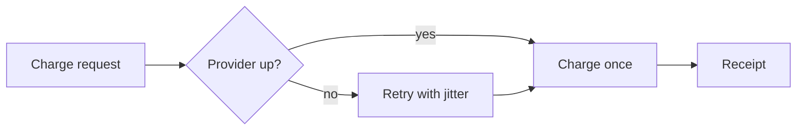

# Payments Retry Plan

We see a 2.1% failure rate on charge attempts during provider brownouts. Most failures are transient. A bounded retry with jitter recovers the majority without risking double charges.

This plan adds an idempotent retry pipeline in front of the provider client. It ships behind a feature flag and rolls out per merchant.

## Design

Retries are safe because every charge attempt carries an idempotency key. The provider deduplicates on that key, so a retry can never double-charge.

Replaying the March brownout showed that three attempts were not enough: 11% of recoverable charges were still failing when the retry budget ran out. The pipeline now allows five attempts, but caps the whole retry window at 30 seconds so a charge can never sit in limbo past the checkout timeout.

```rust
pub async fn charge_with_retry(req: ChargeRequest) -> Result<Receipt, ChargeError> {
    let key = req.idempotency_key.clone();
    let budget = RetryBudget::attempts(5).with_ceiling(Duration::from_secs(30));
    retry::with_backoff(budget, Jitter::Full, || client.charge(&req, &key)).await
}
```



## Rollout

Rollout now starts with a shadow stage: retries are computed and logged but never sent, so we can validate volume projections against real traffic before a single charge is retried.

| Stage | Merchants | Flag | Exit criteria |
|-------|-----------|------|---------------|
| 0 | Shadow mode (log only) | `retry_v2=shadow` | Projected retry volume within budget for 72 h |
| 1 | Internal test | `retry_v2=on` | Zero duplicate receipts in 48 h |
| 2 | 5% cohort | `retry_v2=on` | Failure rate under 0.3% |
| 3 | All | default on | Two clean weeks |

Rollback is a flag flip. No data migration is needed at any stage.
